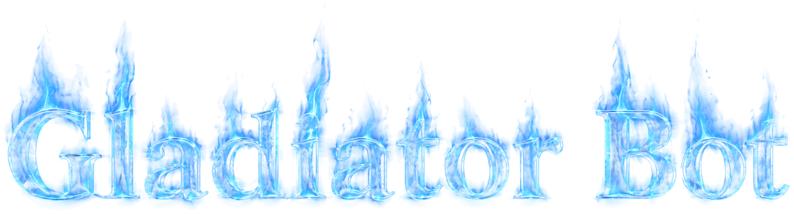

<div align="center">



<h1>Q2 Gladiator Bot Botlib Reconstruction</h1>

<p>
An open, buildable reconstruction of the <b>Gladiator Bot</b> botlib — the bot<br>
library that made Quake II's bots think — recovered from the retail<br>
<code>gladiator.dll</code> so the original mod keeps running on modern toolchains.
</p>

<p>
<a href="https://github.com/themuffinator/Q2-Gladiator-Bot/releases/latest"></a>
<a href="#building"></a>
<a href="#project-status"></a>
<a href="docs/"></a>
</p>

</div>

---

## For Mr Elusive

This project is dedicated to **Mr Elusive** — Jan Paul van Waveren — whose work
it exists to preserve.

In 1997 he started giving Quake bots something the genre did not really have
yet: bots that understood the *space* they were fighting in. The Gladiator Bot
grew out of that, and the ideas underneath it were genuinely new. The **Area
Awareness System** pre-compiled a level into a navigation representation with
reachabilities between areas — not waypoints scattered by hand, but a derived
understanding of where a body can actually go, and how: walk, jump, swim,
teleport, ride a lift, take a rocket to the face and land somewhere useful. A
**fuzzy-logic weight system** let a bot's taste in items and weapons be
authored as readable config rather than buried in code, so a bot's personality
became something you could write down. A **chat system** with match contexts
and synonym substitution gave them something to say about it.

Gladiator became the bot people ran, and it earned him the job: id Software
hired him to write the bot AI for **Quake III Arena**, where the same lineage
shipped as `botlib` and became the reference every later id-engine bot was
measured against. His master's thesis, *The Quake III Arena Bot*, is still one
of the clearest pieces of writing on game AI anyone has produced — it explains
the reasoning, not just the result. He later worked on id Tech engines and at
Oculus on asynchronous timewarp. He died in 2017.

The best thing you can say about a piece of engineering is that people are
still trying to understand exactly how it worked twenty-five years later,
because it was that good. That is what this repository is.

Every line here is a reconstruction of his design. The credit is his; the bugs
are ours.

---

## What this is

The Gladiator Bot is two binaries, and this repository builds both:

| Module | What it is | Origin |
| --- | --- | --- |
| `gladiator.dll` / `gladiator_x64.so` | The botlib — the bot AI | **Reconstructed** here from the retail binary |
| `gamex86.dll` / `gamex86_64.so` | The game module — Quake II mod logic | **Mr Elusive's own source**, which he released |

The botlib shipped only as a closed binary, so it had to be rebuilt from the
retail module, matching its observable behaviour routine by routine. The game
source he published himself, and it is preserved here essentially untouched —
see [docs/game_source_integration.md](docs/game_source_integration.md).

The result is a complete, buildable mod:

- **The original mod still works.** The botlib keeps the `BotLib v0.96` ABI and
  reads and writes the original AAS file format unchanged. Existing Gladiator
  `.aas` files and asset packs load as they always did.
- **It builds today.** CMake, current compilers, 32-bit and 64-bit, Windows and
  Linux — rather than a 1999 binary and a hope.
- **The design is documented.** The [`docs/`](docs/) tree records the
  address-level mapping from the retail module to this source, so the
  reconstruction can be checked rather than trusted.

It is not a fork, a rewrite, or a "modern reimagining". Where the original did
something odd, this reproduces the odd thing, and says so in the docs.

## Project status

**Functionally complete, and under continued testing.**
Full detail, including every known issue: [docs/project_status.md](docs/project_status.md).

What that means concretely:

| | |
| --- | --- |
| Retail divergence backlog | **80 of 80 confirmed entries applied** — see [docs/retail_divergence_backlog.md](docs/retail_divergence_backlog.md) |
| Tracked AI-row parity | **98.5%** (67 of 68 catalogued rows) — see [docs/parity_audit_report.md](docs/parity_audit_report.md) |
| Export contract | **20 of 20** retail export wrappers covered |
| Runtime | Loads in a real Quake II dedicated server; bots navigate, fight and chat |
| Builds | win32, win64, linux64 |
| Test suite | 31 of 35 CTest entries pass; 3 skip on absent optional assets; **1 fails** |

**It works, as far as we have been able to test it — which is not the same as
saying it is finished.**

This is a reconstruction of a 1999 binary, assembled from decompiled
references. The subsystems are all present and the bots play, but coverage is
uneven: the parity matrix catalogues 68 AI rows against a retail module of
roughly 756 routines, several test fixtures are gated on binary map assets that
are not in the repository, and the headless harness has been exercised on a
small number of maps. Every one of those is a place where a difference could
still be hiding.

Expect ongoing testing to surface issues — unusual maps, other mods, other
source ports, long-running servers. That is the normal state of a project like
this, not a sign something is wrong. If a bot behaves unlike the original,
that is a bug worth reporting, and the docs are written so it can be traced
back to a specific routine.

Known limits, stated plainly — the full list is in
[docs/project_status.md](docs/project_status.md):

- One test fails: the AAS loader's zip-archive fallback probes no archives when
  it should probe three (`tests/aas/test_aas_map.c:2256`). It affects the zip
  fallback path only, not the loose-file or `pak` paths an ordinary install
  uses.
- One catalogued AI divergence remains open: `BotConstructChatMessage` does not
  reproduce retail's unsafe behaviour on malformed input.
- Five retail behaviours are **deliberately** not reproduced, because they are
  a double free, two memory leaks, an out-of-bounds read and a
  nondeterministic stale-stack read. Each is documented at its call site.
- Some parity fixtures skip without binary map assets
  (`dev_tools/assets/maps/test_mover.{bsp,aas}`), so a local `ctest` run will
  report skips.
- Several documents in `docs/` are working notes from the reverse-engineering
  effort and describe intent as much as current state. Start from
  [docs/README.md](docs/README.md), which says which is which.

## Versioning

Two version numbers, kept separate on purpose:

- **Reconstruction version** (`1.0.0`) — this project. It names release
  archives, appears in the DLL's file properties, and is embedded in the module
  as a recoverable marker string.
- **Legacy botlib version** (`0.96`) — the retail module being reconstructed.
  This is what `BotVersion()` returns and what the startup banner prints,
  frozen because the Gladiator mod links against exactly those bytes.

Full policy: [docs/reconstruction_versioning.md](docs/reconstruction_versioning.md).

## Releases

Builds are published from the **Release** workflow
([`.github/workflows/release.yml`](.github/workflows/release.yml)), run
manually from the Actions tab. Each release ships three archives, each carrying
**both modules** — the botlib and the game module — plus `INSTALL.txt`, a
`VERSION.txt` with a SHA-256 per module and the source commit, and the full
documentation tree:

| Archive | Use it for |
| --- | --- |
| `…-win32.zip` | **Retail Quake II and the original Gladiator mod.** Start here. |
| `…-win64.zip` | 64-bit Windows source ports |
| `…-linux64.zip` | 64-bit Linux source ports |

32-bit is the one that matters for retail Quake II — the original engine cannot
load a 64-bit module. The 64-bit builds are for modern source ports.

Game assets (`pak*.pak`) are not included; the archives ship code only.

To build the same archive locally:

```bash
python tools/package_release.py --platform win32 --binary build-x86/gladiator.dll --binary build-x86/src/game/gamex86.dll
```

## The original releases

Mr Elusive's own distribution files are mirrored in [`archive/`](archive/),
byte for byte, exactly as published on
[his download page](https://mrelusive.com/oldprojects/gladiator/download.shtml.htm).
They are the ground truth this reconstruction is measured against, and a
hedge against the day that site stops answering. Sections, descriptions and
dates below follow his page; checksums and provenance are in
[`archive/README.md`](archive/README.md).

### Gladiator bot

| File | Size | Date | Description |
| --- | ---: | --- | --- |
| `gladq2096_win32-x86.exe` | 1.1 MB | 1999-07-20 | [v0.96 for Win32 x86](archive/gladiator-bot/gladq2096_win32-x86.exe) |
| `gladq2096_linux-x86-libc5.tar.gz` | 886 kB | 1999-08-02 | [v0.96 for Linux x86 libc5](archive/gladiator-bot/gladq2096_linux-x86-libc5.tar.gz) |
| `gladq2096_linux-x86-glibc.tar.gz` | 886 kB | 1999-08-02 | [v0.96 for Linux x86 glibc](archive/gladiator-bot/gladq2096_linux-x86-glibc.tar.gz) |
| `gladq2096gamesrc.zip` | 539 kB | 1999-08-02 | [v0.96 game source](archive/gladiator-bot/gladq2096gamesrc.zip) |

### Bot characters

| File | Size | Date | Description |
| --- | ---: | --- | --- |
| `gbc092_epilepsy.zip` | 5 kB | 1999-04-01 | [EPiLePSy (by Zindahsh)](archive/bot-characters/gbc092_epilepsy.zip) |
| `gbc092_ernie.zip` | 3 kB | 1999-04-05 | [Evil Ernie (by Felix)](archive/bot-characters/gbc092_ernie.zip) |
| `gbc092_fuel.zip` | 4 kB | 1999-04-05 | [Fuel (by Felix)](archive/bot-characters/gbc092_fuel.zip) |
| `gbc092_garf.zip` | 5 kB | 1999-04-10 | [garF (by Blair Williams)](archive/bot-characters/gbc092_garf.zip) |
| `gbc092_morphias.zip` | 3 kB | 1999-04-10 | [MorpHias (by Blair Williams)](archive/bot-characters/gbc092_morphias.zip) |
| `gbc092_keyboy.zip` | 4 kB | 1999-04-15 | [KeyBoy (by Zindahsh)](archive/bot-characters/gbc092_keyboy.zip) |
| `gbc092_garf9.zip` | 14 kB | 1999-05-02 | [9 chars (by Blair Williams)](archive/bot-characters/gbc092_garf9.zip) |
| `gbc092_swarm.zip` | 4 kB | 1999-05-10 | [Swarm (by Jason)](archive/bot-characters/gbc092_swarm.zip) |

### WinBSPC

| File | Size | Date | Description |
| --- | ---: | --- | --- |
| `winbspc12.zip` | 117 kB | 1999-05-20 | [WinBSPC v1.2 Win32 x86](archive/bspc/winbspc12.zip) |
| `bspc12_win32-x86.zip` | 103 kB | 1999-05-20 | [BSPC v1.2 Win32 x86](archive/bspc/bspc12_win32-x86.zip) |
| `bspc12_linux-x86-libc5.tar.gz` | 108 kB | 1999-05-20 | [BSPC v1.2 Linux x86 libc5](archive/bspc/bspc12_linux-x86-libc5.tar.gz) |
| `bspc12_linux-x86-glibc.tar.gz` | 108 kB | 1999-05-20 | [BSPC v1.2 Linux x86 glibc](archive/bspc/bspc12_linux-x86-glibc.tar.gz) |

His page also lists a *Misc* section — Omicron Bot and MeQCC. Neither is part
of the Gladiator Bot, so neither is mirrored here.

## Building

### Prerequisites

CMake 3.16+, Ninja, and Python 3.8+ on every platform.

| Platform | Toolchain | Notes |
| --- | --- | --- |
| Windows | **LLVM/Clang** (`clang-cl`) | What the release workflow uses and the best-tested path. Run from an MSVC developer prompt so the Windows SDK is on `PATH`. |
| Linux | GCC 11+ or Clang 14+ | `sudo apt-get install build-essential ninja-build` |
| macOS | Xcode command-line tools | Builds, but is not covered by the release workflow. |

### Quick start

```bash
python dev_tools/bootstrap_cmake.py
```

This configures `build/` and builds the botlib. Use it if you hit
`missing CMakeCache.txt` after a fresh clone. It does not build the game
module — for that, use the explicit commands below.

### 32-bit Windows module (what retail Quake II loads)

```bash
cmake -S . -B build-x86 -G Ninja -DCMAKE_BUILD_TYPE=Release -DBUILD_TESTING=OFF -DCMAKE_C_COMPILER=clang-cl -DCMAKE_CXX_COMPILER=clang-cl -DCMAKE_C_FLAGS=-m32 -DCMAKE_CXX_FLAGS=-m32 -DCMAKE_EXE_LINKER_FLAGS=/machine:x86 -DCMAKE_SHARED_LINKER_FLAGS=/machine:x86
```

```bash
cmake --build build-x86 --target gladiator game --parallel
```

### 64-bit modules

```bash
cmake -S . -B build -G Ninja -DCMAKE_BUILD_TYPE=Release
```

```bash
cmake --build build --target gladiator game --parallel
```

The `gladiator` target is the botlib; `game` is Mr Elusive's game module, which
lands in `build/src/game/`. Pass `-DBUILD_GAME_MODULE=OFF` to skip it and build
the botlib alone.

The build emits `gladiator.dll` on Windows and `gladiator_x64.so` on 64-bit
Linux (`gladi386.so` on 32-bit, the name retail shipped),
alongside a static archive per subsystem.

### Installing into a staging tree

```bash
cmake --install build --prefix /path/to/gladiator/install
```

This drops the module and the generated CMake export file into the prefix, so
downstream projects can consume it via `find_package(gladiator CONFIG)`.

## Testing

Parity fixtures are cmocka-backed and built by default when testing is on:

```bash
cmake -S . -B build -G Ninja -DBUILD_TESTING=ON
```

```bash
cmake --build build --target botlib_parity_tests
```

CMake fetches cmocka over HTTPS from `gitlab.com` on first configure. If the
host cannot reach it, re-run with `-DBOTLIB_PARITY_ENABLE_SOURCES=OFF` to skip
the cmocka targets and still build the modules.

Setting `-DBOTLIB_PARITY_FRAMEWORK=none` on its own does **not** work: with
`BOTLIB_PARITY_ENABLE_SOURCES` still ON, `tests/CMakeLists.txt` force-resets
the framework back to `cmocka` and fetches anyway.

Fixtures that need binary map assets will skip; see
[docs/parity_testing_guide.md](docs/parity_testing_guide.md) for what to stage.
The longer-running headless check that boots a real dedicated server is
documented in
[docs/testing/headless_quake2_parity_check.md](docs/testing/headless_quake2_parity_check.md).

## Asset packaging

The original release shipped its data in numbered `pak` archives. `dist/`
mirrors that layout (`bots/`, `maps/`, `sounds/`, …). Drop updated assets under
`dist/gladiator/`, then:

```bash
python dev_tools/package_assets.py
```

This writes a legacy-compatible `pak7.pak` next to `dist/`. Declare additional
packages in `dist/pak_manifest.json` to split assets across archives. Ship the
generated `pak*.pak` files alongside the module.

During development, point `GLADIATOR_ASSET_DIR` (or the `gladiator_asset_dir`
libvar) at a directory of loose files to override packaged content. The runtime
extracts bundled assets into a local `.pak_cache/` when archives are used, and
still prefers explicit overrides.

## Repository layout

| Path | Contents |
| --- | --- |
| `src/botlib/` | The reconstructed botlib: `aas/`, `ai*/`, `common/`, `precomp/`, `ea/`, `interface/` |
| `src/game/` | Mr Elusive's v0.96 game module, preserved — see [docs/game_source_integration.md](docs/game_source_integration.md) |
| `src/q2bridge/` | Translation between the Quake II game module and the botlib |
| `src/shared/` | Cross-cutting headers and the generated version header |
| `tools/bspc/` | Reconstruction of the AAS compiler |
| `tools/package_release.py` | Builds a release archive |
| `tests/` | cmocka parity fixtures, golden files, and the headless harness |
| `docs/` | Address-level reverse-engineering notes — see [docs/README.md](docs/README.md) |
| `dev_tools/` | Reference material: HLIL export, Quake III Arena source, assets. Read-only |
| `dist/` | Asset-packaging tree mirroring the original mod layout |

### Exported symbols

Embedders should include `src/shared/platform_export.h` for the `GLADIATOR_API`
annotation used by `GetBotAPI`. It maps to `__declspec(dllexport)` on Windows
and default ELF visibility elsewhere.

The module explicitly disables `WINDOWS_EXPORT_ALL_SYMBOLS`, so a built
`gladiator.dll` exports exactly one symbol — `GetBotAPI` — matching retail.
Additional public functions must be marked `GLADIATOR_API` to be exported.

## Credits

- **Mr Elusive** (Jan Paul van Waveren) — the
  [Gladiator Bot for Quake II](https://mrelusive.com/oldprojects/gladiator/gladiator.html),
  the Area Awareness System, BSPC, and the
  [Quake III Arena bot library](https://github.com/id-Software/Quake-III-Arena/tree/master/code/botlib).
  All of the design in this repository is his, and `src/game/` is his own
  released source rather than a reconstruction.
- **Xatrix** (*The Reckoning*), **Rogue** (*Ground Zero*), **Zoid** (Quake II
  CTF) and **David Wright** (Rocket Arena 2 bot support) — the game source he
  built on incorporates work from each; see
  [`src/game/ORIGINAL_README.txt`](src/game/ORIGINAL_README.txt).
- **id Software** — Quake II and Quake III Arena, and for releasing the Quake III
  Arena source under the GPL, without which reconstructing the Gladiator botlib
  would have been guesswork.
- The **[gladiator-bot-restored](https://github.com/Niehztog/gladiator-bot-restored)**
  project, used throughout as an independent cross-check.
