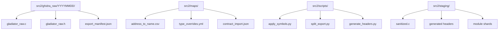

# Introducing a Fresh Ghidra C Export into GladiatorBot-reverse

## Executive summary

The repository is already structured around a staged reconstruction of `gladiator.dll`, but it is not in a clean “drop in a raw export and compile” state. The strongest existing anchors are not the current C sources alone; they are the Binary Ninja HLIL dump path declared in the repo, the contract-extraction script that maps fixed addresses to exported function names and diagnostics, the generated `tests/reference/botlib_contract.json`, the original bundled `dev_tools/game_source/botlib.h`, and the parity-oriented docs and harnesses that were built around those artifacts. Together, those files already give you an address-to-name seed map, test oracles, ABI expectations, and subsystem boundaries. fileciteturn56file0 fileciteturn38file0 fileciteturn40file0 fileciteturn47file0 fileciteturn42file0 fileciteturn46file0

The most important repository finding is that the repo currently contains structural contradictions you should treat as first-class migration risks before importing a fresh Ghidra export. The top-level CMake build uses strict source auditing over `src/` and registered targets, so any new `.c` dropped into `src/` without registration will intentionally fail configuration. At the same time, several production files currently contain unresolved merge-conflict markers, including `src/botlib/interface/botlib_interface.c`, `src/botlib/interface/bot_interface.c`, and other botlib modules. That means the right place for a fresh raw export is a staging tree outside audited `src/`, and the right approach is not direct replacement, but controlled intake, symbol mapping, automated sanitation, module splitting, and then gradual integration. fileciteturn61file0 fileciteturn60file0 fileciteturn52file0 fileciteturn36file0 fileciteturn50file0

A second major finding is ABI drift between the repo’s current headers and the original bundled 0.96 game-source header. The original `dev_tools/game_source/botlib.h` explicitly states that the botlib DLL source is not included, exposes a much smaller export table, and defines a smaller `bot_input_t` than the current reconstructed `src/q2bridge/botlib.h`, which contains many additional exported entry points and an extra `weapon` field in `bot_input_t`. The repo’s internal `src/botlib/interface/botlib_interface.h` also defines a third, different import-table abstraction. A fresh Ghidra export should therefore be used first to re-establish the **binary-exact external ABI**, then to reconcile internal bridge abstractions, not vice versa. fileciteturn41file0 fileciteturn42file0 fileciteturn31file0 fileciteturn32file0 fileciteturn59file0

The recommended plan is to create a new `src2/` staging pipeline, import the raw Ghidra `.c` and `.h` there, apply all extant symbol maps and address maps automatically, generate module-local and ABI headers from the staged code, split the export along the repo’s existing subsystem boundaries, and only then register stable files into `src/` and CMake. Ghidra itself supports C export of a selection or entire program, including a corresponding header, and its decompiler quality materially improves when you first feed it good type information and associated headers. That matches the repo’s needs exactly. fileciteturn56file0 fileciteturn42file0 citeturn10view1turn10view0turn8view3

## Repository baseline and the constraints it imposes

The repo’s top-level build is CMake-based, with `gladiator` built as a shared library from registered subsystem sources, and with `WINDOWS_EXPORT_ALL_SYMBOLS` explicitly disabled. The build adds subdirectories for `src/shared`, `src/botlib/common`, `src/botlib/precomp`, `src/botlib/aas`, `src/botlib/ea`, `src/botlib/ai`, `src/q2bridge`, and `src/botlib/interface`; then it verifies all botlib sources and audits registered files against the tree. In practice, that means the repo already assumes a curated, subsystem-split source layout, not a monolithic decompiler dump. fileciteturn61file0 fileciteturn60file0 fileciteturn62file0 fileciteturn63file0 fileciteturn64file0

The repo also carries a committed `build-clang/` tree showing a Windows + Clang + Ninja configuration with `BUILD_TESTING=ON`, `BOTLIB_PARITY_FRAMEWORK=cmocka`, and many botlib, parity, AI, chat, and engine-parity targets. That is useful as evidence of intended workflows, but it should not become the source of truth for intake decisions because it is machine-local, committed build output. Use it as a baseline for expected target names and test groupings, not as a canonical build definition. fileciteturn45file0 fileciteturn44file0

The coding-style situation is mixed, but the repo does have a declared normative style. `AGENTS.md` says C/C++ should use tabs and a required commented header format above every function definition, and that `dev_tools/` is read-only. Existing headers show mixed use of `#pragma once` and traditional include guards, while implementation files mix modern block comments, tabbed legacy banners, and four-space formatting. For a new intake, the practical rule should be: **preserve raw export fidelity in `src2/`**, but only apply the repo’s normative conventions when code crosses into curated `src/`. fileciteturn56file0 fileciteturn54file0 fileciteturn55file0 fileciteturn34file0

The most consequential baseline contradiction is ABI drift. The original 0.96 bundled `dev_tools/game_source/botlib.h` exports only the classic lifecycle/client/map/test surface and defines a smaller import table and `bot_input_t`. The current `src/q2bridge/botlib.h` adds a much larger export surface for goals, movement, weights, weapons, chat, and more, and it adds fields not present in the bundled original header. The repo’s internal `src/botlib/interface/botlib_interface.h` further introduces a reduced shim-specific import abstraction. This is not necessarily wrong for the reconstruction effort, but it means a fresh Ghidra export should be treated as an **ABI adjudicator**. fileciteturn42file0 fileciteturn31file0 fileciteturn32file0 fileciteturn59file0

A compact artifact-to-symbol map for migration planning is below.

| Repo artifact | What it anchors | Target symbols or symbol families |
| --- | --- | --- |
| `dev_tools/gladiator.dll.bndb_hlil.txt` + `dev_tools/extract_botlib_contract.py` fileciteturn40file0 fileciteturn38file0 | Primary reverse-engineering source and scripted address index | Export addresses such as `0x10037e10`, helper guards, diagnostic strings, return codes |
| `tests/reference/botlib_contract.json` fileciteturn47file0 | Machine-readable export/address/diagnostic oracle | `BotLibLoadMap`, `BotLibAI`, `BotLibConsoleMessage`, etc., with fixed addresses |
| `docs/botlib_ai_function_map.md` fileciteturn65file1 | Human-maintained AI function grouping | AI subsystem names and likely split boundaries |
| `docs/botlib_import_comparison.md` fileciteturn33file15 | Import-slot comparison reference | Engine callback names and bridge mapping targets |
| `dev_tools/game_source/botlib.h` fileciteturn42file0 | Original 0.96 public ABI and libvar vocabulary | Legacy external structs, enums, macros, export/import table names |
| `src/q2bridge/botlib.h` fileciteturn31file0 fileciteturn32file0 | Current reconstructed public header | Current `GetBotAPI`, present repo export table, bridge-facing ABI |
| `src/botlib/interface/bot_interface.[ch]` fileciteturn34file0 fileciteturn55file0 | External wrapper and public DLL entry | `GetBotAPI`, wrapper exports, interface-layer glue |
| `src/botlib/interface/botlib_interface.[ch]` fileciteturn51file0 fileciteturn59file0 | Internal lifecycle and import shim | `BotSetupLibrary`, `BotShutdownLibrary`, import-table bridging |

The repo already has useful validation scaffolding. `tests/parity/README.md` describes export-by-export parity fixtures keyed to the HLIL contract, `tests/reference/botlib_contract.json` stores the contract, `tests/README.md` documents asset expectations, and `tests/engine_parity/run_engine_parity.py` stages the built `gladiator.dll` into a throw-away game tree for Quake II dedicated-server validation. This is exactly the kind of infrastructure you want to preserve while introducing a fresh raw export. fileciteturn46file0 fileciteturn47file0 fileciteturn30file0 fileciteturn48file0 fileciteturn49file0

## Intake layout and symbol-mapping pipeline

The cleanest intake is a **non-audited staging tree** under `src2/`. That recommendation follows directly from two repo facts: `dev_tools/` is read-only, and `src/` is guarded by source-audit logic that will fail on unregistered `.c` files. A fresh Ghidra export therefore belongs in `src2/` until it has been sanitized, mapped, and split. fileciteturn56file0 fileciteturn61file0 fileciteturn60file0



A practical directory layout is:

```text
src2/
  ghidra_raw/
    2026-05-24/
      gladiator_raw.c
      gladiator_raw.h
      export_manifest.json
  maps/
    contract_from_hlil.json
    address_to_name.csv
    symbol_overrides.csv
    type_overrides.yml
  scripts/
    apply_symbols.py
    split_export.py
    generate_headers.py
    sanity_scan.py
  staging/
    gladiator_sanitized.c
    include/
    modules/
```

The symbol-harvest order should be deterministic and loss-averse:

1. Seed address-to-name mappings from `tests/reference/botlib_contract.json` and the address table in `dev_tools/extract_botlib_contract.py`. Those are the strongest existing machine-readable maps in the repo. fileciteturn47file0 fileciteturn38file0  
2. Import legacy ABI names, macros, and struct tags from `dev_tools/game_source/botlib.h`. fileciteturn42file0  
3. Import current reconstructed public symbols from `src/q2bridge/botlib.h` and internal bridge names from `src/botlib/interface/botlib_interface.h`. fileciteturn31file0 fileciteturn59file0  
4. Harvest doc-level semantic maps such as `docs/botlib_ai_function_map.md`, `docs/botlib_import_comparison.md`, and `docs/aas_reachability_mapping.md` as secondary naming guides, but never let prose docs override fixed-address machine maps. fileciteturn65file1 fileciteturn33file15 fileciteturn65file0  
5. Then augment from external artifacts when available: linker MAP files, PDB, DWARF, IDA XML, or a Ghidra/BN script export.

For external symbol sources, the strongest primary references are straightforward. MSVC `/MAP` produces a text map file containing public symbols, addresses, the defining object file, and the entry point. DWARF 5 standardizes symbol lookup, macro representation, and debug sections; `llvm-dwarfdump` can search by name and dump debug info entries, and `llvm-pdbutil` can dump PDB symbols, publics, externals, types, modules, and lines. These are the right authoritative inputs when available. citeturn9view0turn9view1turn14view0turn14view2turn13view0

A practical Python renamer for raw Ghidra exports is below. It is intentionally conservative: it avoids replacing inside strings and comments, only applies token-safe rewrites, and gives precedence to exact-address mappings.

```python
#!/usr/bin/env python3
"""
Apply address-based symbol replacements to a raw Ghidra C export.

Inputs:
  - raw C file containing FUN_/DAT_/LAB_ style names
  - CSV with columns: address, kind, name
    Example:
      10037e10,FUN,BotLibLoadMap
      10038380,FUN,BotLibAI
      10064020,DAT,g_botImport

Usage:
  python apply_symbols.py src2/ghidra_raw/2026-05-24/gladiator_raw.c \
      src2/maps/address_to_name.csv \
      -o src2/staging/gladiator_sanitized.c
"""

from __future__ import annotations

import argparse
import csv
import re
from pathlib import Path

TOKEN_RE = re.compile(r'\b(?:FUN|DAT|LAB|SUB)_[0-9A-Fa-f]{6,16}\b')

def load_map(path: Path) -> dict[str, str]:
    replacements: dict[str, str] = {}
    with path.open("r", encoding="utf-8", newline="") as f:
        for row in csv.DictReader(f):
            addr = row["address"].strip().lower().removeprefix("0x")
            kind = row["kind"].strip().upper()
            name = row["name"].strip()
            if not name:
                continue
            key = f"{kind}_{addr}"
            replacements[key] = name
    return replacements

def split_preserving_comments_and_strings(text: str) -> list[tuple[str, bool]]:
    # True => code segment, False => comment/string segment
    pattern = re.compile(
        r'("([^"\\]|\\.)*")|'
        r"(\'([^'\\]|\\.)*\')|"
        r"(//[^\n]*\n?)|"
        r"(/\*.*?\*/)",
        re.DOTALL,
    )
    out = []
    last = 0
    for m in pattern.finditer(text):
        if m.start() > last:
            out.append((text[last:m.start()], True))
        out.append((m.group(0), False))
        last = m.end()
    if last < len(text):
        out.append((text[last:], True))
    return out

def replace_tokens(code: str, replacements: dict[str, str]) -> str:
    def repl(match: re.Match[str]) -> str:
        tok = match.group(0)
        prefix, addr = tok.split("_", 1)
        key = f"{prefix}_{addr.lower()}"
        return replacements.get(key, tok)
    return TOKEN_RE.sub(repl, code)

def main() -> int:
    ap = argparse.ArgumentParser()
    ap.add_argument("input_c", type=Path)
    ap.add_argument("map_csv", type=Path)
    ap.add_argument("-o", "--output", type=Path, required=True)
    ns = ap.parse_args()

    raw = ns.input_c.read_text(encoding="utf-8", errors="replace")
    replacements = load_map(ns.map_csv)

    parts = split_preserving_comments_and_strings(raw)
    rewritten = "".join(
        replace_tokens(seg, replacements) if is_code else seg
        for seg, is_code in parts
    )

    ns.output.parent.mkdir(parents=True, exist_ok=True)
    ns.output.write_text(rewritten, encoding="utf-8")
    return 0

if __name__ == "__main__":
    raise SystemExit(main())
```

The key edge cases are predictable. Do **not** rename `LAB_` labels into semantic function names unless you have a label-specific map; local labels are CFG artifacts, not global symbols. Do not rewrite inside comments or string literals. Guard against collisions where two addresses are given the same semantic name by introducing namespace prefixes such as `aas__`, `ai__`, or `iface__`. Keep a reject list for ambiguous names that differ between the current repo ABI and the original 0.96 header. And if the raw export includes duplicated prototypes or forward declarations, run replacement before splitting, but after a first parse pass that inventories declarations. The reason to keep this pipeline outside Ghidra is practical reproducibility; the reason to keep Ghidra in the loop is type recovery. Ghidra’s decompiler supports persistent scripted decompilation, C-code output, and stronger results when you enrich signatures and datatypes first. citeturn7view0turn10view0turn15view1

## Header generation and source splitting

Ghidra can export C code for a function or entire program, including a corresponding `.h`, and its own training guide explicitly notes that associated header files improve type propagation and therefore output quality. For this repo, the right strategy is therefore **two-pass export**: first enrich the Ghidra program with known headers and types; then export; then regenerate curated headers from the staged code rather than treating the raw Ghidra header as canonical. citeturn10view1turn10view0turn8view3

Before the export, feed Ghidra these type sources:

- `dev_tools/game_source/botlib.h` for original external ABI and libvar vocabulary. fileciteturn42file0
- `src/q2bridge/botlib.h` for current repo-facing ABI names. fileciteturn31file0
- `src/shared/platform_export.h` and `src/botlib/interface/bot_interface.h` for the exported `GetBotAPI` declaration shape already used by the repo. fileciteturn55file0
- Module-local headers such as `bot_weight.h` where the repo has already reconstructed concrete types. fileciteturn54file0

The split rules should follow existing subsystem boundaries already encoded by CMake and docs, not arbitrary decompiler chunks:

| Module boundary | Suggested headers | Suggested sources | Primary reason |
| --- | --- | --- | --- |
| Public ABI | `src/q2bridge/botlib.h`, `src/shared/platform_export.h` | none or tiny export shim | Binary-exact API surface |
| Interface layer | `bot_interface.h`, `botlib_interface.h`, `bot_state.h` | `bot_interface.c`, `botlib_interface.c`, `bot_state.c` | `GetBotAPI`, lifecycle, client state |
| Bridge layer | `bridge.h`, `bridge_config.h`, `aas_translation.h`, `update_translator.h` | `bridge.c`, `bridge_config.c`, `aas_translation.c`, `update_translator.c` | Engine-to-botlib adaptation |
| Core utilities | `l_*.h` under `common/` and `precomp/` | `l_memory.c`, `l_log.c`, parser/util files | Shared support, allocators, precompiler |
| AAS | `aas_*.h` and `aas_local.h` | `aas_*.c` | Navigation and map/AAS handling |
| AI domains | `ai_dm.h`, `bot_goal.h`, `bot_move.h`, `bot_weapon.h`, `bot_weight.h`, `ai_chat.h`, `bot_character.h` | matching `ai_*` and `bot_*` sources | Semantic subsystem ownership |

The header-generation workflow should be:

1. **Parse the sanitized export** and inventory every `typedef`, `struct`, `enum`, `#define`, `extern`, and function declaration.  
2. **Classify by module** using function address maps, include dependencies, string constants, and nearest existing module match from the repo.  
3. **Emit three header classes**:  
   - binary/public ABI headers;  
   - module-public headers used across repo subsystems;  
   - module-private/internal headers.  
4. **Demote unstable decompiler debris** into private staging headers only.  
5. **Promote verified legacy names** from the original 0.96 header over decompiler-generated placeholders wherever the layouts match.  

A practical split rule for structs is: if a type crosses the DLL boundary, keep it in the public ABI header; if it is shared across two or more internal modules, keep it in a module-public header; if it is used only in one `.c`, make it private. For macros, keep literal ABI constants and error codes public, but move compile-time helpers, array-size shims, and decompiler sanitation macros to private staging headers. That is especially important here because the current repo already has multiple header layers for essentially overlapping concepts. fileciteturn42file0 fileciteturn31file0 fileciteturn59file0

## Refactoring, build, and fix cycle

The refactor plan should be deliberately staged:

```mermaid
flowchart LR
    A[Import raw Ghidra export into src2] --> B[Apply address/name maps]
    B --> C[Compile monolith with shim headers]
    C --> D[Fix syntax, typedefs, calling conventions]
    D --> E[Generate headers and split by subsystem]
    E --> F[Integrate stable shards into src/]
    F --> G[Resolve warnings and ownership issues]
    G --> H[Run parity and engine validation]
```



### Refactor sequence

Start with **mechanical rehabilitation**, not semantic cleanup. That means: strip merge-conflict markers in the repo files you must touch, normalize duplicate declarations, add temporary typedef shims for `undefinedN`, `byte`, `word`, `dword`, `code`, and calling-convention noise, and build the raw export in one translation unit first. Only after that should you split the file. The repo already has enough build and audit logic that premature splitting will multiply failures. fileciteturn52file0 fileciteturn36file0 fileciteturn61file0

Then perform **semantic stabilization** in this order:

- Reconcile external ABI types against `dev_tools/game_source/botlib.h`.  
- Reconcile exported names and addresses with `tests/reference/botlib_contract.json`.  
- Reconcile bridge/local abstractions against `src/q2bridge/botlib.h` and `src/botlib/interface/botlib_interface.h`.  
- Split by subsystem.  
- Only then improve constness, ownership, and naming. fileciteturn42file0 fileciteturn47file0 fileciteturn31file0 fileciteturn59file0

### Common Ghidra-export compile failures and first fixes

| Failure mode | Why it happens | First fix |
| --- | --- | --- |
| `undefined`, `undefined4`, `undefined8`, `code` not known | Ghidra emits placeholder datatypes for unresolved types | Introduce a temporary `ghidra_compat.h` in `src2/staging/include/` and replace incrementally |
| Wrong calling convention keywords | PE-oriented decompilation often preserves compiler-specific annotations | Keep a `#define __cdecl` / `__stdcall` shim layer until ABI is verified |
| Duplicate globals or functions after splitting | Monolithic export contains file-scope artifacts that become multiply defined | Split only after full declaration inventory; emit `extern` into module headers |
| `LAB_` / `goto` detritus | Raw CFG recovery | Do not rename labels semantically; leave until function-level cleanup |
| Pointer/integer truncation warnings | 32-bit assumptions encoded as casts | Replace with `uintptr_t`/`intptr_t` and audited helper casts |
| Struct layout mismatch | Decompiler inferred wrong field types/padding | Re-anchor against original header, PDB/DWARF when available, and actual use-sites |
| Massive include cycles | Generated header includes everything | Emit layered public/private headers and use forward declarations aggressively |
| Export surface drift | Current repo ABI exceeds original 0.96 header | Keep binary-exact ABI isolated from internal convenience APIs |

For automated cleanup, the tool choices are straightforward. `clang-format` should be used only after syntax stabilization and module splitting; it supports project-local `.clang-format` configuration, in-place edits, range formatting, and ignore files. `clang-tidy` should be used with a compilation database, ideally generated by CMake with `-DCMAKE_EXPORT_COMPILE_COMMANDS=ON`, and then run in parallel with `run-clang-tidy.py`; it can apply fixes via `-fix`, export fix YAML, and target only selected headers or files. `Coccinelle` is the right tool for repeated structural rewrites such as API renames, argument insertion, or systematic cast normalization, because it was designed for C matching and transformation via semantic patches. citeturn11view0turn12view0turn12view1turn16view1

Concrete rules I would apply in this repo:

- Keep **binary-exact public ABI names** untouched unless verified against address maps.  
- Use `const` aggressively on incoming strings, tables, and read-only config structures only after ABI agreement.  
- Introduce `uintptr_t`-based cast helpers for any pointer–integer round-trips.  
- Replace magic constants with named enums/macros only when backed by the original header, contract JSON, or stable subsystem evidence.  
- Do not migrate raw monolith code into `src/` until every new file is registered through the existing source-audit mechanism. fileciteturn61file0 fileciteturn60file0

## Validation, CI integration, risks, and timeline

The repo already points toward the right validation stack. There are cmocka-backed parity tests, documented parity fixtures, a contract JSON generated from the HLIL dump, and an engine-parity harness that boots a Quake II dedicated server against a staged `gladiator.dll`. That means you can validate at three layers: compile-time, contract/parity-time, and in-engine runtime. fileciteturn46file0 fileciteturn47file0 fileciteturn48file0 fileciteturn49file0

The build-and-fix cycle I recommend is:

1. `cmake -S . -B build -G Ninja -DCMAKE_BUILD_TYPE=Debug -DBUILD_TESTING=ON -DCMAKE_EXPORT_COMPILE_COMMANDS=ON`  
2. Build only the staging/rehab target first.  
3. Once sanitized shards enter `src/`, build `gladiator`.  
4. Run targeted tests by regex or label, then broaden. CTest supports `--output-on-failure`, `--parallel`, `-R` for test-name regex, and `-L` for label selection, which is exactly what you want for iterative subsystem bring-up. citeturn16view2

For CI, I would implement or extend three lanes:

- **Fast lane**: configure + build + `clang-tidy` on touched files.  
- **Parity lane**: `ctest --output-on-failure -R parity` or label-equivalent subsets.  
- **Nightly engine lane**: `tests/engine_parity/run_engine_parity.py` with staged server binary and optional assets. fileciteturn49file0 citeturn16view2

The dominant risks are not theoretical; they are visible in the repo right now.

| Risk | Why it matters | Mitigation |
| --- | --- | --- |
| Existing merge-conflict debt | Fresh import effort may be blocked by unrelated broken files | Resolve touched conflict-bearing files first; quarantine intake in `src2/` |
| ABI drift between original and current headers | You can “compile green” while silently breaking binary compatibility | Reconstruct binary-exact ABI first, then bridge to internal headers |
| Over-eager symbol renaming | A wrong semantic rename is harder to unwind than a raw address symbol | Use address-indexed maps and a reject list for ambiguous names |
| Premature splitting | Multiplies compile and linkage failures | Compile monolith first, split second |
| Type propagation pollution | Incorrect imported types can poison decompiler output globally | Keep imported datatypes versioned and review binary-facing structs manually |

My effort estimate, as an engineering inference from the repo’s current state, is roughly **two to four focused weeks** for one expert to go from fresh raw export to a cleanly split, compiling, test-integrated baseline. The lower end assumes the export is not enormous and that the merge-conflict debt is limited to a handful of files; the upper end assumes meaningful ABI reconciliation and runtime parity tuning.

### Open questions and limitations

I did not inventory every file in the repository tree, so the artifact analysis here is intentionally concentrated on the top-level build, interface/ABI headers, parity assets, and the strongest symbol-mapping files. The repo also contains a committed build tree and multiple historical/reference directories, so “what is authoritative” is not uniformly encoded everywhere. The highest-confidence sources are the top-level CMake files, the original bundled 0.96 header, the HLIL contract script and JSON, and the parity/test harnesses. fileciteturn61file0 fileciteturn42file0 fileciteturn38file0 fileciteturn47file0

## Deliverables and prioritized next actions

The concrete deliverables I would produce are:

- `src2/ghidra_raw/<date>/gladiator_raw.c` and `.h`
- `src2/maps/address_to_name.csv`
- `src2/maps/contract_from_hlil.json` generated from the existing contract extractor
- `src2/scripts/apply_symbols.py`
- `src2/scripts/generate_headers.py`
- `src2/scripts/split_export.py`
- `src2/staging/include/ghidra_compat.h`
- `docs/src2_intake_workflow.md`
- `docs/abi_reconciliation.md`
- curated source shards integrated into `src/` only after they pass the existing audit/build rules
- updated parity fixtures and, where needed, refreshed `tests/reference/botlib_contract.json` from the existing extractor. fileciteturn38file0 fileciteturn47file0 fileciteturn61file0 fileciteturn60file0

The prioritized next-action checklist is:

- **Resolve the currently touched merge-conflict files first**, especially `src/botlib/interface/botlib_interface.c` and `src/botlib/interface/bot_interface.c`, because they will otherwise contaminate every later build/fix cycle. fileciteturn52file0 fileciteturn36file0
- **Create `src2/` and import the fresh Ghidra export there**, not under `dev_tools/` and not directly under audited `src/`. fileciteturn56file0 fileciteturn61file0
- **Generate an address-to-name seed map** from `tests/reference/botlib_contract.json` and `dev_tools/extract_botlib_contract.py`. fileciteturn47file0 fileciteturn38file0
- **Reconcile the external ABI against `dev_tools/game_source/botlib.h` before any deep refactor**, especially export-table shape, import-table shape, and `bot_input_t`. fileciteturn42file0 fileciteturn31file0
- **Run the direct symbol-replacement pass** on the raw export and build it as one staged translation unit with temporary compatibility shims.
- **Generate staged headers and split along the repo’s existing subsystem boundaries**, matching CMake modules rather than arbitrary decompiler chunks. fileciteturn61file0 fileciteturn62file0 fileciteturn63file0 fileciteturn64file0
- **Enable compilation database output and introduce `clang-tidy`/`clang-format` only after syntax stabilization**, with Coccinelle reserved for repeated tree-wide rewrites. citeturn12view0turn12view1turn11view0turn16view1
- **Wire the resulting shards into parity and engine validation immediately**, using the repo’s existing cmocka/CTests and the Quake II engine harness. fileciteturn46file0 fileciteturn48file0 fileciteturn49file0 citeturn16view2